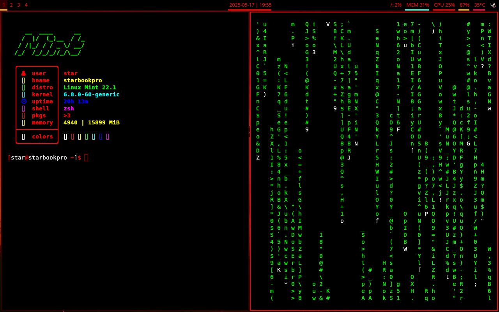

# Cyberpunk i3wm Dotfiles

A complete cyberpunk-themed i3 window manager setup with Polybar, Rofi, and custom configurations.



## Components

- i3 window manager with a cyberpunk theme
- Polybar with custom modules and red/black theme
- Rofi app launcher with matching theme
- Custom screenshot utility (mod+shift+x)
- Zsh with syntax highlighting and auto-suggestions
- Neovim with AstroNvim configuration
- Nitrogen for wallpaper management

## Compatibility

This configuration has been tested and works on:
- Debian/Ubuntu-based distributions (Linux Mint, Ubuntu, etc.)
- Arch-based distributions (Arch Linux, Manjaro, EndeavourOS, etc.)

The installation script automatically detects your distribution type and installs the appropriate packages.

## Installation

To install this configuration on a new machine:

```bash
git clone https://github.com/Staravora/dotfiles.git
cd dotfiles
./install.sh
